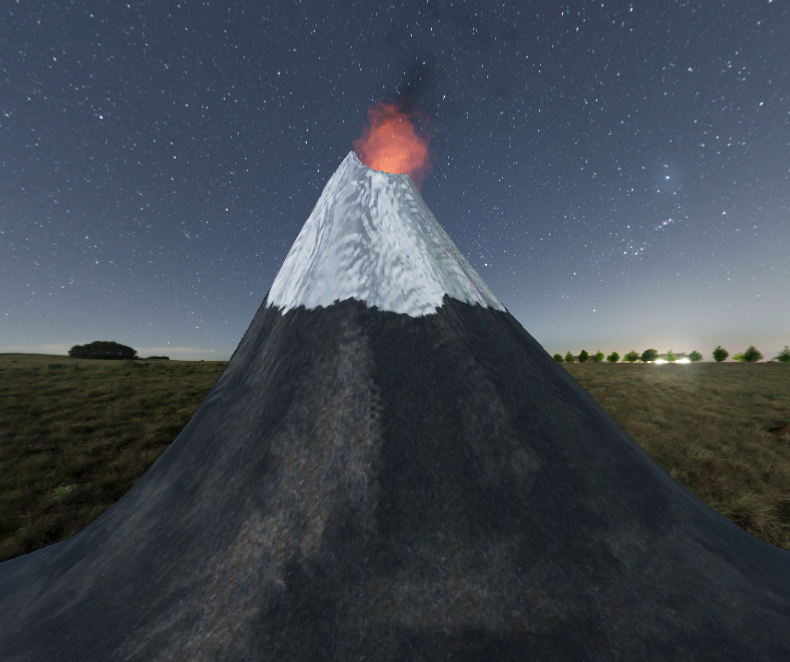

# CC3501-tarea4

Simulación de volcán con sistema de partículas para efectos de llama y humo. 

Inspirado en: [video www.youtube.com/ ... b_channel=Capturasur](https://www.youtube.com/watch?v=n7lZjJ3u4AY)

Tarea Final del curso Modelación y Computación Gráfica.

